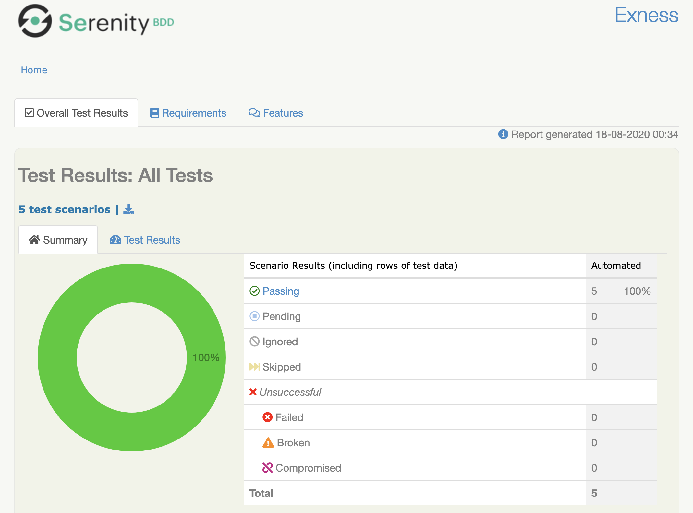
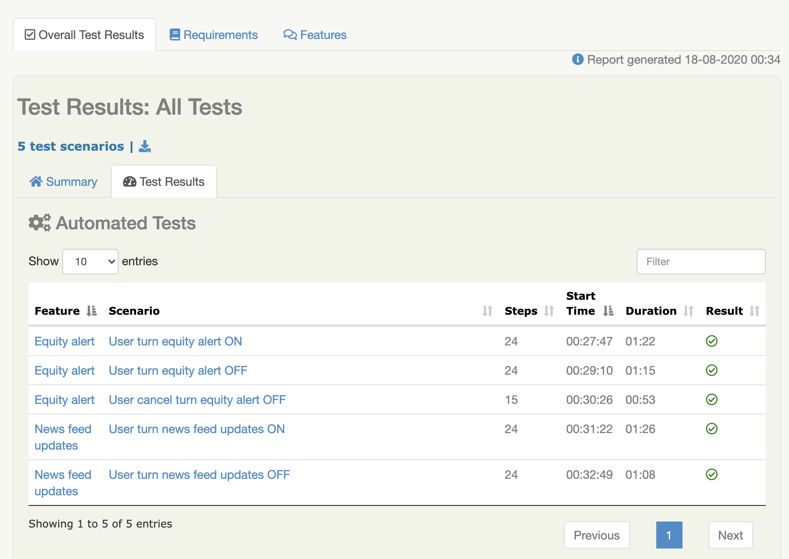

# Exness mobile automated tests with Serenity BDD (wrapping Appium) and Cucumber

## Get the code:

    git clone git@github.com:arustamov/exness-mobile-test.git
    cd exness-mobile-test
    
## Connect/Run an Android device instance (physical or emulator) and verify with:

    adb devices
    
## Start appium:
    
    script/start_appium.sh

## Run the test(s) with Maven against Android device (physical or emulator):

For example against android emulator single instance running as emulator-5554:
    
    mvn clean verify -Dappium.udid=emulator-5554 -Dappium.app=/path/to/apk
    
## View the report:

Open `index.html` test report in the `target/site/serenity` directory

    open target/site/serenity/index.html
